<div align="center">


[](https://python.org)
[](https://opencv.org)
[](https://mediapipe.dev)
[](LICENSE)

**Control games and applications using hand gestures detected through your webcam**

[Features](#-features) • [Installation](#-installation) • [Usage](#-usage) • [How It Works](#-how-it-works) • [Configuration](#%EF%B8%8F-configuration)

</div>

---


## 🎮 Demo


<div align="center">
  <i>📹 Demo video coming soon...</i>
</div>

---

## ✨ Features

<table>
<tr>
<td width="33%" align="center">


### 🖐️ Gesture Recognition
Intuitive hand gesture controls for steering, acceleration, and special actions

</td>
<td width="33%" align="center">


### ⚡ Real-Time Tracking
Smooth 30+ FPS hand tracking with minimal latency using MediaPipe

</td>
<td width="33%" align="center">


### 🎛️ Fully Customizable
Adjustable thresholds, sensitivity settings, and visual feedback

</td>
</tr>
</table>

### Key Capabilities

- 🎯 **Precise Steering Control** - Tilt your hands like a steering wheel
- 📏 **Distance Detection** - Hands close/far triggers different actions  
- 👆 **Finger Gestures** - Forward/backward with finger combinations
- 🎨 **Visual Feedback** - Real-time overlay showing detected gestures
- 🔧 **Easy Calibration** - Auto-centering and manual threshold adjustment
- 💾 **Persistent Settings** - Your preferences are saved between sessions


## 🔧 Requirements

### System Requirements

| Component | Minimum | Recommended |
|-----------|---------|-------------|
| **OS** | Windows 10 / macOS 10.14 / Ubuntu 18.04 | Windows 11 / macOS 12+ / Ubuntu 22.04 |
| **Python** | 3.8 | 3.10+ |
| **RAM** | 4 GB | 8 GB+ |
| **Webcam** | 720p @ 30fps | 1080p @ 30fps |
| **CPU** | Dual-core 2.0 GHz | Quad-core 2.5 GHz+ |

### Dependencies


```
opencv-python>=4.5.0
mediapipe>=0.10.0
numpy>=1.21.0
```

---

## 📦 Installation

### Quick Start

```bash
# Clone the repository
git clone https://github.com/YOUR_USERNAME/gesture-control-game.git
cd gesture-control-game

# Create virtual environment (recommended)
python -m venv venv

# Activate virtual environment
# On Windows:
venv\Scripts\activate
# On macOS/Linux:
source venv/bin/activate

# Install dependencies
pip install -r requirements.txt
```

### Manual Installation

```bash
pip install opencv-python mediapipe numpy
```

<details>
<summary><b>🐧 Linux Additional Steps</b></summary>

On Linux, you may need to install additional packages:

```bash
sudo apt-get update
sudo apt-get install -y libgl1-mesa-glx libglib2.0-0
```

</details>

<details>
<summary><b>🍎 macOS Camera Permissions</b></summary>

On macOS, you'll need to grant camera permissions:

1. Go to **System Preferences** → **Security & Privacy** → **Privacy**
2. Select **Camera** from the left sidebar
3. Check the box next to your terminal application or Python

</details>

---

## 🚀 Usage

### Running the Application

```bash
python main.py
```

### Command Line Options

```bash
python main.py --camera 0          # Select camera index (default: 0)
python main.py --width 1280         # Set capture width
python main.py --height 720         # Set capture height
python main.py --no-gui             # Run without visual overlay
```

### Keyboard Controls

| Key | Action |
|-----|--------|
| `Q` / `ESC` | Quit application |
| `R` | Reset/recalibrate |
| `S` | Toggle skeleton overlay |
| `T` | Toggle trails |
| `+` / `-` | Adjust sensitivity |
| `SPACE` | Pause detection |

---

## 🖐️ How It Works

### Gesture Detection System


### Steering Mechanism

The steering is calculated based on the **vertical difference (dy)** between your left and right wrist positions:

```
┌─────────────────────────────────────────────────────────────┐
│                                                             │
│    LEFT HAND HIGH          NEUTRAL           RIGHT HAND HIGH│
│         ┌──┐              ┌──┐ ┌──┐              ┌──┐       │
│         │  │              │  │ │  │              │  │       │
│         └──┘   ┌──┐       └──┘ └──┘       ┌──┐   └──┘       │
│                │  │         ═══════       │  │              │
│                └──┘                       └──┘              │
│                                                             │
│       STEER LEFT         NO STEERING        STEER RIGHT     │
│                                                             │
└─────────────────────────────────────────────────────────────┘
```

### Detection Pipeline

```mermaid
flowchart LR
    A[📷 Webcam] --> B[🖼️ Frame Capture]
    B --> C[🤖 MediaPipe]
    C --> D[✋ Hand Landmarks]
    D --> E[📐 Gesture Analysis]
    E --> F[🎮 Game Input]
    E --> G[📊 Visual Feedback]
```



### Gesture Types

<details>
<summary><b>🔄 Steering (Two Hands)</b></summary>

- **How**: Hold both hands up, tilt like a steering wheel
- **Detection**: Compares vertical position of left vs right wrist
- **Output**: Continuous value from -60° to +60°
- **Threshold**: Steering activates when angle exceeds ±35° (configurable)

</details>

<details>
<summary><b>📏 Distance (Two Hands)</b></summary>

- **Close**: Hands within ~12% of frame width → triggers "close" action
- **Far**: Hands beyond ~55% of frame width → triggers "far" action
- **Use Case**: Zoom, brake/accelerate, menu navigation

</details>

<details>
<summary><b>👆 Finger Gestures (Single Hand)</b></summary>

- **Forward**: Index + Middle fingers extended, others closed
- **Backward**: Only thumb extended
- **Use Case**: Acceleration, item selection, confirmation

</details>

---

## ⚙️ Configuration

### Configuration File

Settings are stored in `config.json`:

```json
{
  "thresholds": {
    "steering_angle": 35.0,
    "hands_close_dist": 0.12,
    "hands_far_dist": 0.55,
    "finger_extend_thresh": 0.06,
    "stability_delay": 0.18,
    "steering_dy_scale": 180.0,
    "visual_max_angle": 60.0
  },
  "sensitivity": {
    "steering": 1.0,
    "distance": 1.0,
    "fingers": 1.0
  },
  "display": {
    "show_skeleton": true,
    "show_trails": true,
    "show_steering_bar": true
  }
}
```

### Threshold Descriptions

| Parameter | Default | Description |
|-----------|---------|-------------|
| `steering_angle` | 35.0 | Degrees of tilt needed to trigger steering |
| `hands_close_dist` | 0.12 | Distance threshold for "close" detection |
| `hands_far_dist` | 0.55 | Distance threshold for "far" detection |
| `stability_delay` | 0.18 | Seconds a gesture must hold before triggering |
| `steering_dy_scale` | 180.0 | Multiplier for vertical difference to angle |

---

## 📁 Project Structure

```
gesture-control-game/
├── 📄 main.py                 # Application entry point
├── 📄 gesture_detector.py     # Core gesture detection logic
├── 📄 utils.py                # Helper utilities (smoothing, filters)
├── 📄 config.json             # User configuration
├── 📄 requirements.txt        # Python dependencies
├── 📄 README.md               # This file


```

---

## 🔍 Troubleshooting

<details>
<summary><b>❌ Camera not detected</b></summary>

1. Check if another application is using the camera
2. Try a different camera index: `python main.py --camera 1`
3. Verify camera permissions (especially on macOS)
4. Test camera with another app first

</details>

<details>
<summary><b>❌ Poor hand detection</b></summary>

1. Ensure good lighting (avoid backlight)
2. Use a plain background if possible
3. Keep hands within frame and visible
4. Adjust `min_detection_confidence` in code (default: 0.4)

</details>

<details>
<summary><b>❌ Steering not centered</b></summary>

1. Press `R` to recalibrate
2. Hold hands level when starting
3. Adjust `steering_dy_scale` in config if consistently off-center

</details>

<details>
<summary><b>❌ Laggy performance</b></summary>

1. Reduce camera resolution: `--width 640 --height 480`
2. Close other applications
3. Disable visual overlays: `--no-gui`
4. Check CPU usage - MediaPipe is CPU-intensive

</details>

<details>
<summary><b>❌ MediaPipe installation fails</b></summary>

```bash
# Try upgrading pip first
pip install --upgrade pip

# Install with specific version
pip install mediapipe==0.10.9

# On Apple Silicon Macs
pip install mediapipe-silicon
```

</details>

---

## 🤝 Contributing

Contributions are welcome! Here's how you can help:

1. **Fork** the repository
2. **Create** a feature branch: `git checkout -b feature/amazing-feature`
3. **Commit** your changes: `git commit -m 'Add amazing feature'`
4. **Push** to the branch: `git push origin feature/amazing-feature`
5. **Open** a Pull Request

### Development Setup

```bash
# Clone your fork
git clone https://github.com/YOUR_USERNAME/gesture-control-game.git

# Install dev dependencies
pip install -r requirements-dev.txt

# Run tests
python -m pytest tests/
```

---


<div align="center">


</div>
